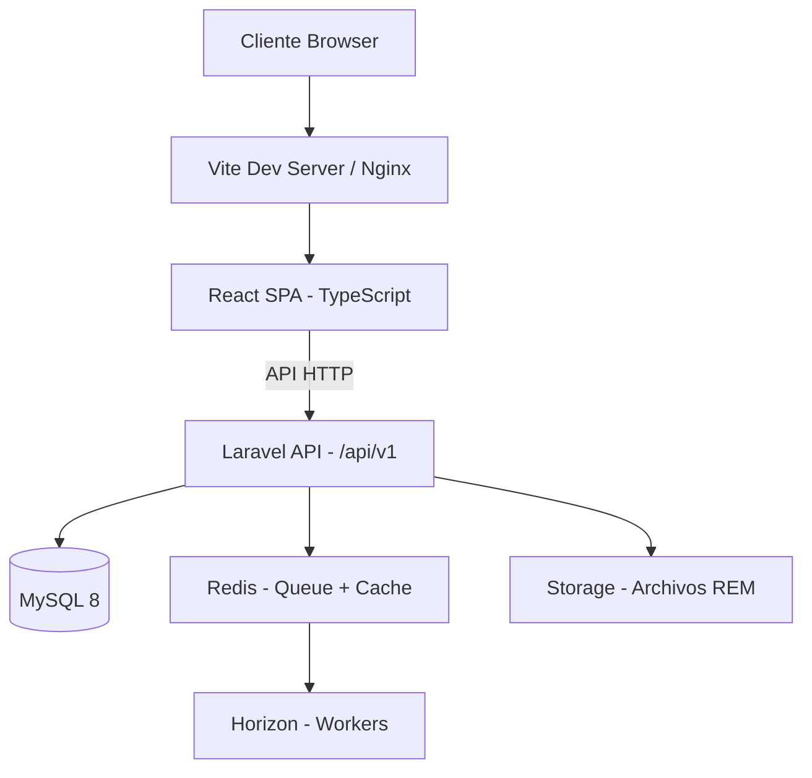

# Arquitectura del sistema

> Fecha: 2026-05-27 | Versión: 0.1

## Diagrama de arquitectura

## Capas

| Capa | Tecnología | Función |
|---|---|---|
| Presentación | React 19 + TypeScript + TailwindCSS | SPA, renderizado del lado del cliente |
| API | Laravel 13 + Sanctum | REST API, autenticación, lógica de negocio |
| Datos | MySQL 8 | Persistencia principal, índices funcionales sobre JSON |
| Async | Redis + Queue + Horizon | Procesamiento de archivos REM, notificaciones |
| Almacenamiento | Disco / S3 | Archivos REM subidos, documentos |

## Flujo de petición HTTP (ejemplo)

1. Usuario sube archivo REM desde el frontend
2. React envía `POST /api/v1/rem-uploads` con archivo adjunto (token Sanctum en header)
3. Laravel valida autenticación y permisos (Spatie Permission)
4. Controlador delega en un Job para procesamiento asíncrono
5. Job parsea el archivo REM, extrae datos y los guarda en `rem_data` (JSON)
6. Se registra la actividad en `activity_log` (Spatie Activitylog)
7. Frontend polling con React Query para conocer el estado

## Patrones aplicados

- **Domain-Driven Design** en la organización del backend (`app/Domain/`)
- **Feature-based** en la organización del frontend (`src/features/`)
- **Repository Pattern** para acceso a datos
- **DTOs** para transferencia de datos entre capas
- **Job/Queue** para operaciones pesadas (procesamiento REM)
