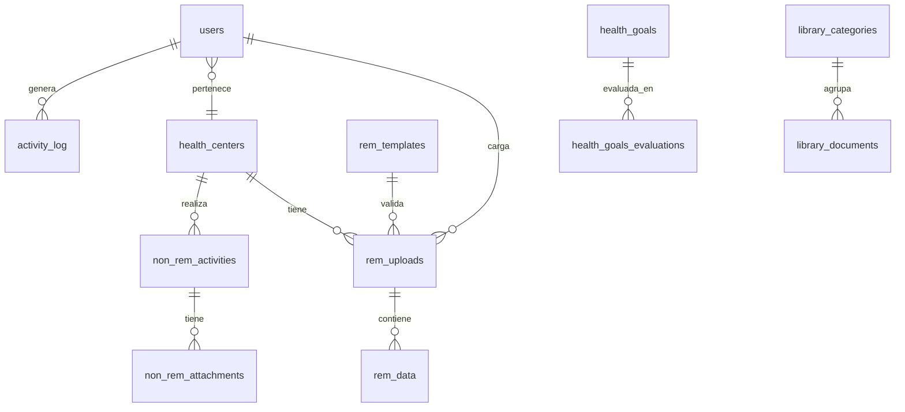

# Modelo Entidad-Relación

> Estado: **EN DESARROLLO** — Tablas users, health_centers, rem_templates, rem_uploads, rem_data implementadas (Fase 04A + 04B-2a)
> Fecha: 2026-05-29

## Diagrama ER

## Definición de tablas

### users

| Campo | Tipo | Restricciones |
|---|---|---|
| id | BIGINT UNSIGNED | PK, Auto Increment |
| rut | VARCHAR(12) | UNIQUE, NOT NULL |
| name | VARCHAR(255) | NOT NULL |
| email | VARCHAR(255) | UNIQUE, NOT NULL |
| password | VARCHAR(255) | NOT NULL |
| health_center_id | BIGINT UNSIGNED | FK → health_centers.id, NULL |
| is_active | BOOLEAN | DEFAULT TRUE |
| last_login_at | TIMESTAMP | NULL |
| timestamps | TIMESTAMP | created_at, updated_at |

### health_centers

| Campo | Tipo | Restricciones |
|---|---|---|
| id | BIGINT UNSIGNED | PK, Auto Increment |
| name | VARCHAR(255) | NOT NULL |
| code_deis | VARCHAR(10) | UNIQUE, NOT NULL |
| type | ENUM('CESFAM','CECOSF','SAPU','POSTA') | NOT NULL |
| address | VARCHAR(255) | NULL |
| commune | VARCHAR(100) | NOT NULL |
| is_active | BOOLEAN | DEFAULT TRUE |
| timestamps | TIMESTAMP | created_at, updated_at |

### rem_templates ✅ (Fase 04A)

| Campo | Tipo | Restricciones |
|---|---|---|
| id | BIGINT UNSIGNED | PK, Auto Increment |
| year | SMALLINT UNSIGNED | NOT NULL |
| rem_type | VARCHAR(10) | NOT NULL |
| version | VARCHAR(20) | NOT NULL |
| config | JSON | NOT NULL |
| is_active | BOOLEAN | DEFAULT TRUE |
| timestamps | TIMESTAMP | created_at, updated_at |
| soft_deletes | TIMESTAMP | deleted_at NULL |

`UNIQUE(year, rem_type)` — solo una plantilla por año/tipo.

### rem_uploads ✅ (Fase 04A)

| Campo | Tipo | Restricciones |
|---|---|---|
| id | BIGINT UNSIGNED | PK, Auto Increment |
| uuid | CHAR(36) | UNIQUE, NOT NULL |
| health_center_id | BIGINT UNSIGNED | FK → health_centers.id, RESTRICT |
| user_id | BIGINT UNSIGNED | FK → users.id, RESTRICT |
| rem_template_id | BIGINT UNSIGNED | FK → rem_templates.id, SET NULL |
| year | SMALLINT UNSIGNED | NOT NULL |
| month | TINYINT UNSIGNED | NOT NULL |
| rem_type | VARCHAR(10) | NOT NULL |
| original_filename | VARCHAR(255) | NOT NULL |
| stored_path | VARCHAR(500) | NOT NULL |
| file_size | INT UNSIGNED | NOT NULL |
| mime_type | VARCHAR(100) | NOT NULL |
| status | VARCHAR(20) | NOT NULL |
| error_report | JSON | NULL |
| processed_at | TIMESTAMP | NULL |
| timestamps | TIMESTAMP | created_at, updated_at |
| soft_deletes | TIMESTAMP | deleted_at NULL |

`INDEX(health_center_id, year, month, rem_type)` — búsqueda por centro y período.
`INDEX(status)` — filtro por estado de procesamiento.

### rem_data ✅ (Fase 04A)

| Campo | Tipo | Restricciones |
|---|---|---|
| id | BIGINT UNSIGNED | PK, Auto Increment |
| rem_upload_id | BIGINT UNSIGNED | FK → rem_uploads.id, ON DELETE CASCADE |
| section | VARCHAR(20) | NOT NULL |
| data | JSON | NOT NULL |
| timestamps | TIMESTAMP | created_at, updated_at |

`INDEX(rem_upload_id, section)` — consulta por archivo y sección.

> **Justificación de columna JSON**: La estructura de los archivos REM cambia anualmente según las actualizaciones del MINSAL. Usar una columna JSON en MySQL 8 permite:
> - Flexibilidad ante cambios de formato sin migraciones de esquema
> - Índices funcionales sobre campos JSON (`JSON_EXTRACT`, `JSON_VALUE`)
> - Validación con `CHECK (JSON_VALID(data))`
> - Almacenar secciones completas sin desnormalizar

### health_goals

| Campo | Tipo | Restricciones |
|---|---|---|
| id | BIGINT UNSIGNED | PK, Auto Increment |
| code | VARCHAR(20) | UNIQUE, NOT NULL |
| name | VARCHAR(255) | NOT NULL |
| description | TEXT | NULL |
| expected_value | DECIMAL(10,4) | NOT NULL |
| numerator_formula | VARCHAR(500) | NOT NULL |
| denominator_formula | VARCHAR(500) | NOT NULL |
| year | SMALLINT UNSIGNED | NOT NULL |
| is_active | BOOLEAN | DEFAULT TRUE |
| timestamps | TIMESTAMP | created_at, updated_at |

### health_goals_evaluations

| Campo | Tipo | Restricciones |
|---|---|---|
| id | BIGINT UNSIGNED | PK, Auto Increment |
| health_goal_id | BIGINT UNSIGNED | FK → health_goals.id |
| health_center_id | BIGINT UNSIGNED | FK → health_centers.id |
| year | SMALLINT UNSIGNED | NOT NULL |
| month | TINYINT UNSIGNED | NOT NULL |
| numerator_value | DECIMAL(12,2) | NOT NULL |
| denominator_value | DECIMAL(12,2) | NOT NULL |
| achieved_percentage | DECIMAL(5,2) | NOT NULL |
| evaluated_at | TIMESTAMP | NOT NULL |
| evaluated_by | BIGINT UNSIGNED | FK → users.id |
| timestamps | TIMESTAMP | created_at, updated_at |

### library_categories

| Campo | Tipo | Restricciones |
|---|---|---|
| id | BIGINT UNSIGNED | PK, Auto Increment |
| name | VARCHAR(255) | NOT NULL |
| description | TEXT | NULL |
| parent_id | BIGINT UNSIGNED | FK → library_categories.id (self), NULL |
| timestamps | TIMESTAMP | created_at, updated_at |

### library_documents

| Campo | Tipo | Restricciones |
|---|---|---|
| id | BIGINT UNSIGNED | PK, Auto Increment |
| library_category_id | BIGINT UNSIGNED | FK → library_categories.id |
| title | VARCHAR(255) | NOT NULL |
| description | TEXT | NULL |
| file_path | VARCHAR(500) | NOT NULL |
| file_size | INT UNSIGNED | NOT NULL |
| mime_type | VARCHAR(100) | NOT NULL |
| version | SMALLINT UNSIGNED | DEFAULT 1 |
| uploaded_by | BIGINT UNSIGNED | FK → users.id |
| download_count | INT UNSIGNED | DEFAULT 0 |
| timestamps | TIMESTAMP | created_at, updated_at |

### non_rem_activities

| Campo | Tipo | Restricciones |
|---|---|---|
| id | BIGINT UNSIGNED | PK, Auto Increment |
| health_center_id | BIGINT UNSIGNED | FK → health_centers.id |
| user_id | BIGINT UNSIGNED | FK → users.id |
| name | VARCHAR(255) | NOT NULL |
| program | VARCHAR(255) | NOT NULL |
| activity_date | DATE | NOT NULL |
| attendees_count | INT UNSIGNED | NOT NULL |
| sector | VARCHAR(100) | NULL |
| description | TEXT | NULL |
| timestamps | TIMESTAMP | created_at, updated_at |

### non_rem_attachments

| Campo | Tipo | Restricciones |
|---|---|---|
| id | BIGINT UNSIGNED | PK, Auto Increment |
| non_rem_activity_id | BIGINT UNSIGNED | FK → non_rem_activities.id, ON DELETE CASCADE |
| file_path | VARCHAR(500) | NOT NULL |
| original_filename | VARCHAR(255) | NOT NULL |
| mime_type | VARCHAR(100) | NOT NULL |
| timestamps | TIMESTAMP | created_at, updated_at |

### activity_log (Spatie Activitylog)

Esquema estándar del paquete `spatie/laravel-activitylog`:

| Campo | Tipo |
|---|---|
| id | BIGINT UNSIGNED PK |
| log_name | VARCHAR(255) NULL |
| description | TEXT NOT NULL |
| subject_type | VARCHAR(255) NULL |
| subject_id | BIGINT UNSIGNED NULL |
| causer_type | VARCHAR(255) NULL |
| causer_id | BIGINT UNSIGNED NULL |
| properties | JSON NULL |
| batch_uuid | CHAR(36) NULL |
| event | VARCHAR(255) NULL |
| created_at | TIMESTAMP |

### roles / permissions (Spatie Permission)

Esquema estándar del paquete `spatie/laravel-permission`:

- `roles` (id, name, guard_name, created_at, updated_at)
- `permissions` (id, name, guard_name, created_at, updated_at)
- `model_has_roles` (role_id, model_type, model_id)
- `model_has_permissions` (permission_id, model_type, model_id)
- `role_has_permissions` (role_id, permission_id)

## Convenciones aplicadas

- `snake_case` plural para nombres de tablas
- PK: `id BIGINT UNSIGNED AUTO_INCREMENT`
- FK: `singular_id` → `tabla.id`
- `timestamps` (created_at, updated_at) en todas las tablas
- Soft deletes en tablas de dominio (users, health_centers, rem_templates, rem_uploads)
- Índices en todas las FK

## Decisiones pendientes

- [x] Esquema de almacenamiento de archivos REM definido (ADR 0008, disco 'rem-uploads')
- [x] Política de retención: indefinida con soft delete (cumple Ley 21.663)
- [x] Estructura JSON de rem_data definida en Fase 04B-2a (concept, professional, total, values, section)
- [x] Tablas rem_templates, rem_uploads, rem_data implementadas (Fase 04A + 04B-2a)
- [ ] [Por completar con Dorian] Periodicidad de evaluación de metas (mensual/trimestral)